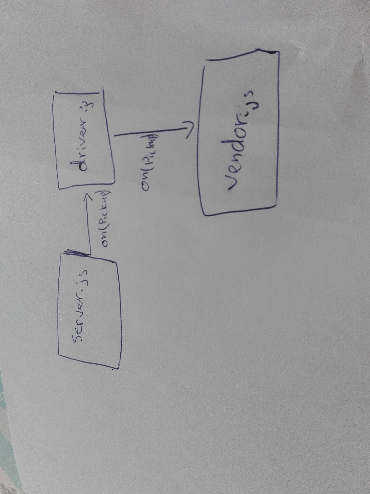

# caps
# LAB - Class 17

## Project: CAPS

### Author: Batool Al-Ali

### Links and Resources

- [submission PR](https://github.com/batool-alali-401-advanced-javascript/caps/pull/5)
- [Live URL]()
- [JsDoc]()
- [ci/cd](https://github.com/batool-alali-401-advanced-javascript/caps/runs/770257173)

### Setup
- .env => 
    - STORE_NAME
    - PORT
    - HOST

#### How to initialize/run your application 
- `$node caps.js`
- `$node driver.js`
- `$node vendor.js`

#### Libraries:
- 'faker.js'

#### tests:
- `$ npm test`
- `$npm run lint`

#### UML
